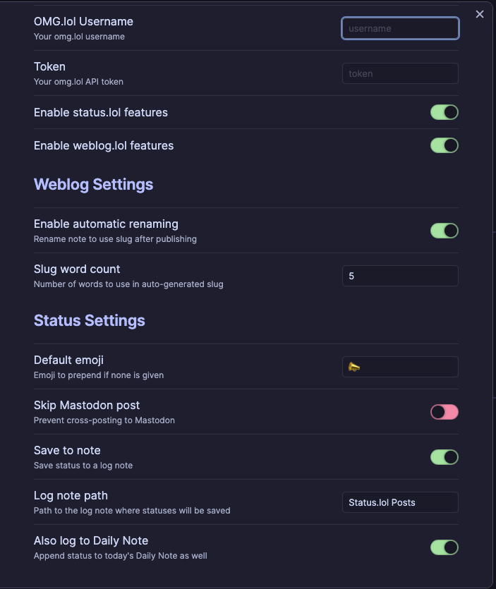
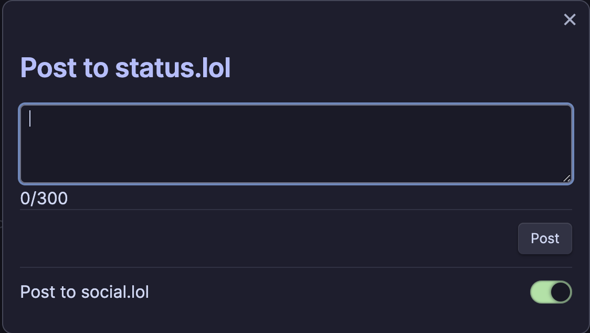

# OMG.lol Publish Plugin for Obsidian

This plugin has changed it's name from Status.lol Plugin to just Omg.lol Publish as you can make post to [weblog.lol](https://weblog.lol) as well as continue to post status updates to [status.lol](https://status.lol). Finally, you can use some.pics to post pictures for all your web needs.

*Since OMG.lol has a great API, there is more than can continue to be built out so why not make this plugin more expandable than the original concept.*

### Configuration Screenshot

### Status.lol Screenshot (Quick posts)

## Features
### Weblog.lol
- Publish blog posts to weblog.lol
- Update prior published posts using the saved weblog entry id
- Backdate time using the fontmatter time functionally
- Tag posts usings fontmatter Tags
- Publish Draft Posts

### Status.lol
- Post status updates to your status.lol address
- Choose whether to also share them on social.lol (this needs to be enabled on social.lol but can toggle off here per post)
- Save to a custom log note or to your Daily Note
- Works with both Daily Notes and Periodic Notes plugins
- If posting to status.lol fails it will still save to a note so you don't lose your status

### Some.pics
- Use to post pictures published on your weblog
- Post single pictures as you would today to some.pics
- Keep a log of what pictures were uploaded from posts in order to map back if pictures go missing
- Keep original pictures in obsidian after upload

### Paste.lol
- 

## Setup

1. Clone or download this repo into your Obsidian `.obsidian/plugins/` folder.
2. Run `npm install` and `npm run build` to compile the plugin.
3. Enable the plugin inside Obsidian.
4. Configure the plugin settings (API key, address, and logging preferences).
