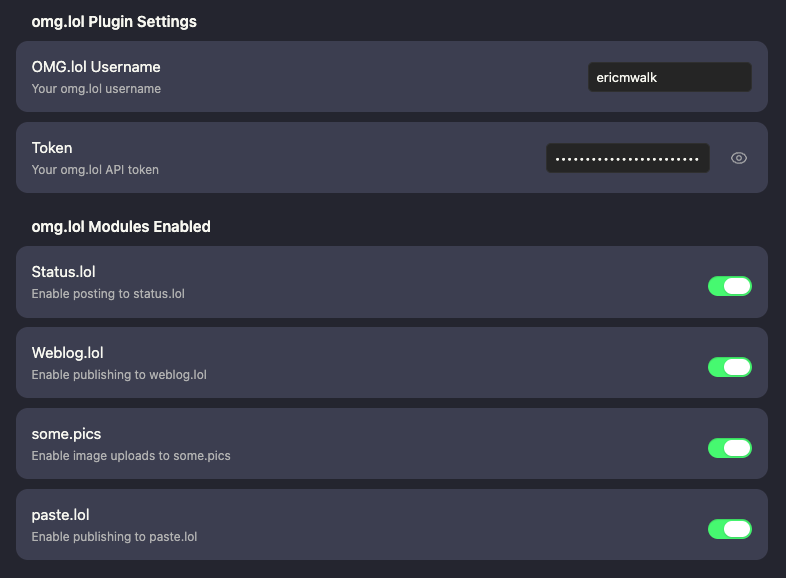
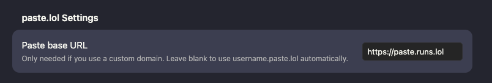
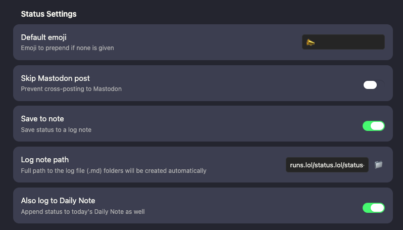
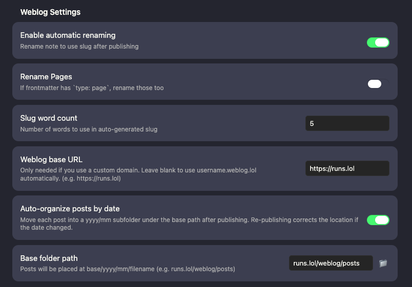
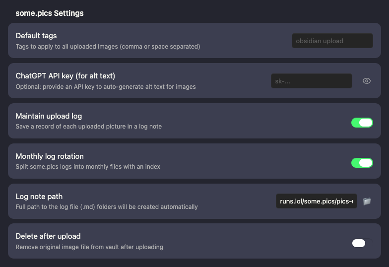

# OMG.lol Publisher Plugin for Obsidian

This plugin has changed it's name from Status.lol Plugin to just Omg.lol Publish as you can make post to  as well as continue to post status updates to . you can use some.pics to post pictures for all your web needs.

Publish and manage your omg.lol presence directly from Obsidian. Write [weblog.lol](https://weblog.lol) posts/pages, [status.lol](https://status.lol) updates, [paste.lol](https://paste.lol) pastes, and [some.pics](https://some.pics) photos without leaving your vault. In addition you can keep your /now page and profile page in sync too.

*Since OMG.lol has a great API, there is more than can continue to be built out so why not make this plugin more expandable than the original concept.*


## Configuration Screenshot
#### Main Settings / Modulals activated


#### paste.lol Settings


#### status.lol Settings


#### weblog.lol Settings


#### some.pics Settings



## Features
### Weblog.lol
- Publish new weblog posts directly from Obsidian
- Update previously published posts using your saved entry ID
- Batch publish multiple posts at once
- Support for backdating or futuredating via frontmatter date/time
- Publish with tags, draft status, custom slug, and page type (read from frontmatter)
- Pass a `template` frontmatter field through to the omg.lol weblog template system
- Automatically rename note files after publishing (optional)
- Auto-organize posts into `yyyy/mm` subfolders after publishing (optional)
- Wikilinks in post body are resolved to URLs on publish
- Import all existing weblog posts from omg.lol into your vault — full frontmatter written on import, duplicates skipped

**Weblog frontmatter fields**
- `entry` — entry ID, written automatically on first publish; used to update existing posts
- `slug` — custom slug; generated from title if not set
- `title` — post title
- `date` — publish date (`YYYY-MM-DD` or `YYYY-MM-DD HH:mm`)
- `status` — `published` or `draft`
- `type` — `page` to publish as a page instead of a post
- `tags` — list of tags
- `template` — omg.lol weblog template to use for this post

### Status.lol
- Post status updates to your status.lol address
- Choose whether to also share them on social.lol (toggle per post)
- Save to a custom log note or to your Daily Note
- Works with both Daily Notes and Periodic Notes plugins
- If posting fails it will still save to a note so you don't lose your status

### Some.pics
- Upload pictures directly from Obsidian to some.pics
- Caption and alt text pre-filled from image metadata
- Keep a log of uploaded pictures to map back if any go missing
- Original files are kept in your vault after upload

### Paste.lol
- Quickly create pastes from a note
- If a fenced code block is present (e.g.,` ```javascript `), only that content is uploaded — the rest of the note stays private
- Falls back to the full note body if no fenced block is found
- Automatically copies the resulting URL back into your note
- Wikilinks are resolved to URLs before creating the paste

### Other omg.lol Pages/Configurations
- Publish your `/now` page directly from a note
- Publish your omg.lol profile web page, including optional custom CSS and HTML `<head>` content
- Update your status.lol bio, including optional custom CSS and HTML `<head>` content
- Content lives in a fenced ` ```markdown ` block in your note; CSS in a ` ```css ` block; custom head HTML in a ` ```html head ` block

**Required frontmatter to identify each note**
- `/now` page: `type: profile` and `entry: now`
- Profile web page: `type: profile` and `entry: web`
- Status.lol bio: `type: status` and `entry: bio`


## Setup

1. Search for **OMG.lol Publisher** in Obsidian's Community Plugins browser and install it.
2. Enable the plugin in Settings → Community Plugins.
3. Open the plugin settings and enter your omg.lol API key and address.
4. Enable the services you want to use (Weblog, Status, Some.pics, Paste.lol).
